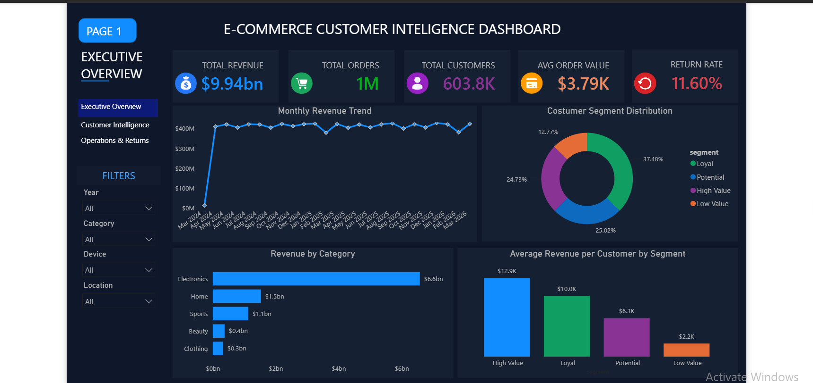
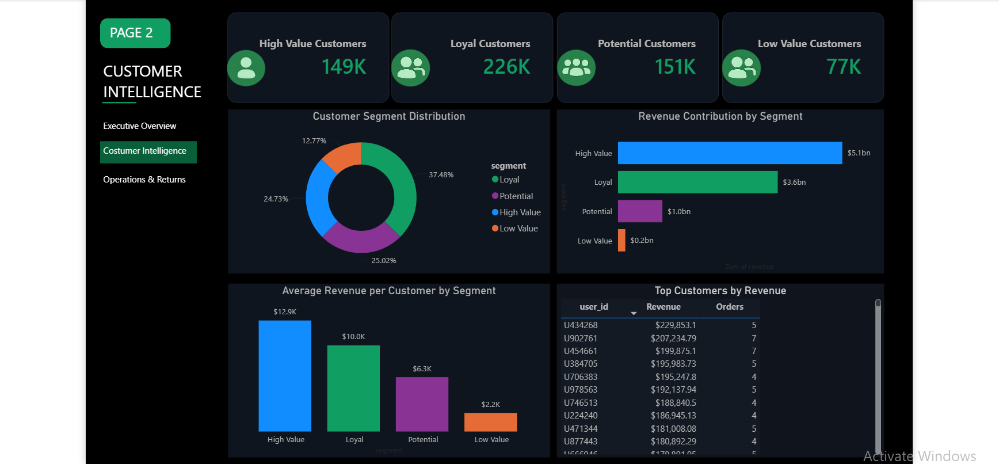
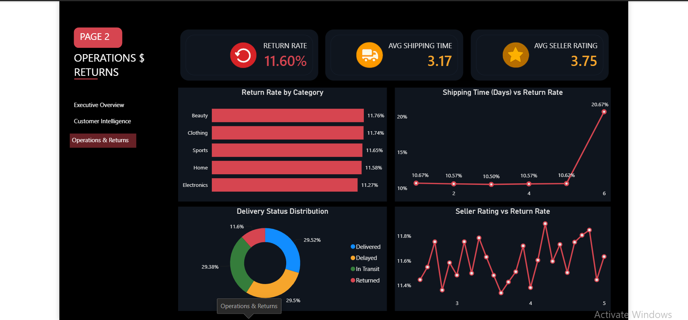

# E-Commerce Customer Intelligence and Operational Performance Dashboard

An end-to-end Business Intelligence project that analyzes one million synthetic e-commerce transactions using Python and Power BI to uncover customer purchasing behavior, revenue drivers, and operational performance insights.

## Dashboard Preview

## Project Overview
This project analyzes a synthetic Amazon-like e-commerce dataset containing **1,000,000 transaction records** to uncover customer purchasing patterns, revenue drivers, and operational factors affecting business performance.

Using **Python** for data cleaning, exploratory data analysis (EDA), and customer segmentation, and **Power BI** for interactive dashboard development, the project transforms raw transactional data into actionable business insights that can support strategic decision-making.

A key component of the analysis is **Recency, Frequency, and Monetary (RFM) segmentation**, which classifies customers into meaningful groups based on their purchasing behavior. The project also evaluates sales performance, product returns, shipping efficiency, and customer value to identify opportunities for revenue growth and operational improvement.

## Business Objectives
The primary objectives of this project were to:

- Analyze overall sales performance and revenue trends.
- Identify the highest-performing product categories.
- Segment customers using the RFM (Recency, Frequency, Monetary) framework.
- Measure the revenue contribution of each customer segment.
- Evaluate product return rates and operational performance.
- Identify opportunities to improve customer retention and business performance through data-driven insights.

## Dataset
The analysis was conducted using a **synthetic Amazon-like E-Commerce dataset** obtained from **Kaggle**. The dataset was designed to simulate realistic customer purchasing behavior, product information, seller performance, and order fulfillment processes in an online marketplace.

### Dataset Summary

- **Source:** [Amazon E-Commerce Dataset (Kaggle)](https://www.kaggle.com/datasets/sharmajicoder/amazon-e-commerce)
- **Dataset Type:** Synthetic E-Commerce Transactions
- **Number of Records:** 1,000,000
- **Number of Features:** 20
- **Time Period:** Transactions spanning the last two years

### Key Features

The dataset includes information on:

- Customer IDs
- Product Categories and Subcategories
- Brands
- Product Pricing and Discounts
- Customer Ratings and Reviews
- Seller Ratings
- Purchase Dates
- Shipping Time
- Customer Location
- Device Used
- Payment Method
- Product Returns
- Delivery Status

> **Note:** This dataset is synthetic and was created for analytical and educational purposes. It does not contain real Amazon customer or transaction data.

## Project Workflow
The project followed a structured analytics workflow consisting of the following stages:

### 1. Data Understanding

- Explored the dataset structure and data types.
- Examined all 20 variables.
- Assessed data quality and identified potential issues.

### 2. Data Preparation

- Converted data into appropriate formats.
- Created additional features required for analysis.
- Prepared the dataset for exploratory analysis and visualization.

### 3. Exploratory Data Analysis (EDA)

Performed exploratory analysis to answer key business questions, including:

- Which product categories generate the most revenue?
- What is the overall product return rate?
- How does revenue vary across customer segments?
- Which operational factors influence product returns?
- How do shipping performance and seller ratings relate to returns?

### 4. Customer Segmentation

Applied **Recency, Frequency, and Monetary (RFM)** analysis to segment customers into:

- High Value
- Loyal
- Potential
- Low Value

These segments were used to evaluate customer value and revenue contribution.

### 5. Dashboard Development

Designed an interactive Power BI dashboard consisting of three pages:

- Executive Overview
- Customer Intelligence
- Operations & Returns

The dashboard was built to enable stakeholders to monitor business performance and support data-driven decision-making.

## Dashboard Walkthrough
### 1. Executive Overview

The Executive Overview page provides a high-level summary of the business, enabling decision-makers to quickly monitor revenue, customers, order volume, return rates, sales trends, and category performance.

**Key Metrics**

- Total Revenue
- Total Orders
- Total Customers
- Average Order Value
- Return Rate

**Visuals Included**

- Monthly Revenue Trend
- Revenue by Category
- Customer Segment Distribution
- Average Revenue per Customer by Segment

### 2. Customer Intelligence

This page focuses on customer behavior and value by leveraging RFM segmentation. It helps identify which customer groups generate the most revenue and highlights the platform's highest-value customers.

**Visuals Included**

- Customer Segment Distribution
- Revenue Contribution by Segment
- Average Revenue per Customer
- Top 10 Customers by Revenue

### 3. Operations & Returns

The Operations & Returns page evaluates operational performance by analyzing return rates, shipping efficiency, seller performance, and delivery outcomes. It highlights operational factors that may influence customer satisfaction and product returns.

**Visuals Included**

- Return Rate by Category
- Shipping Time vs Return Rate
- Seller Rating vs Return Rate
- Delivery Status Distribution

